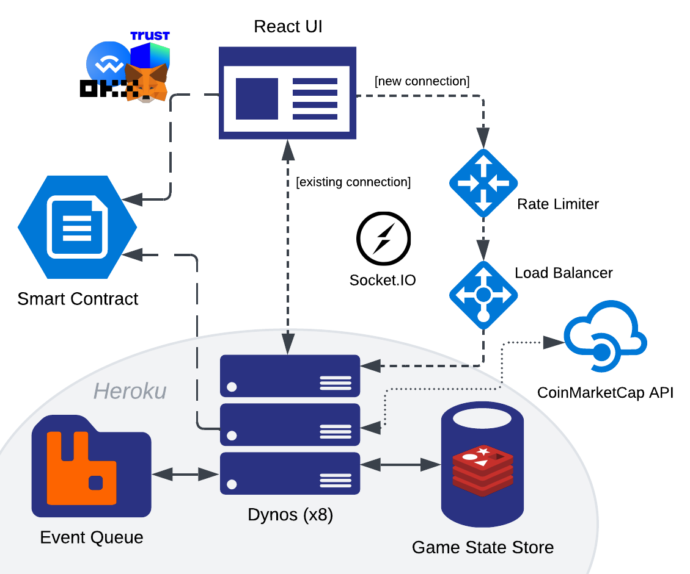

# d&eacute;checs

> from &eacute;checs (French for 'chess') and *de*centralised

Performant multiplayer chess dapp on the Polygon blockchain utilising web3py, wagmi, Socket.IO and react-dnd. A smart contract, written with Solidity, is used to pool players' wagers and then distribute payouts at the conclusion of the match according to the outcome. Game states stored in Redis cache with a RabbitMQ message channels used for passing events between backend workers.

## System design

## Running locally

### Backend

1. Navigate to /api
2. Run `venv/scripts/activate`
3. Ensure Memurai or Redis is running in background or in another terminal window
4. Open another terminal window and run `rabbitmq-server` to start RabbitMQ
5. Run with single worker: `uvicorn app.main:chess_api --reload` or n workers: `uvicorn app.main:chess_api --workers n`

### Frontend

1. Navigate to /ui
2. Run `yarn dev`
