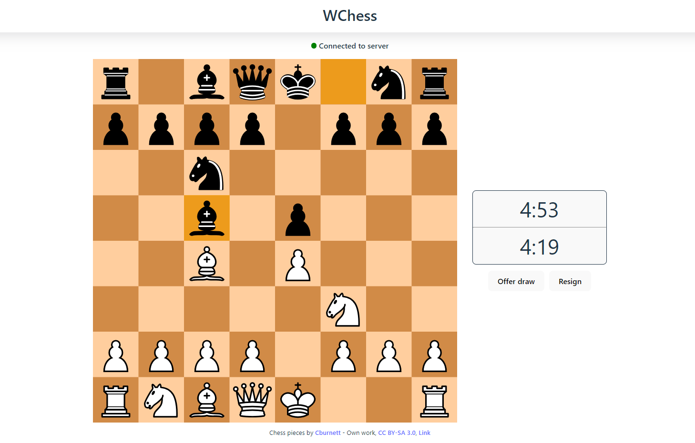

# WChess

Lightweight, performant multiplayer chess web app utilising Socket.IO, python-chess and react-dnd. Features drag and drop interface, CSS piece animations, rematch functionality and multiple time controls. Game states stored in Redis cache with a pub/sub channel used for game events. Backend is currently scaled to 4 uvicorn workers on a single Heroku dyno.

[Site link](https://wchess.netlify.app/)
